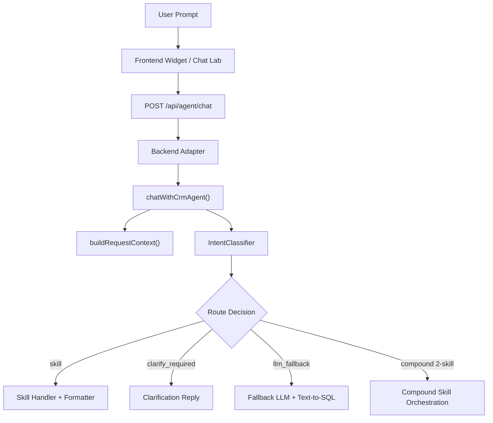
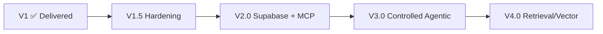

# Review: AI Chat V1 Logic + Roadmap PLAN.md

## Phần 1: Review Logic Hiện Tại (V1)

### 1.1. Kiến trúc tổng thể — Đánh giá: ✅ Phù hợp

Sau khi đọc docs và đối chiếu code thực tế, kiến trúc V1 đã được triển khai **đúng như mô tả** trong `ai-chat-architecture.md`:

**Điểm mạnh đã xác nhận qua code:**

| Thành phần | File | Trạng thái |
|---|---|---|
| Request context builder | [chat-runtime.js:60-105](file:///f:/crm-dashboard-app-local/modules/ai-chat/src/runtime/chat-runtime.js#L60-L105) | ✅ Tách biệt, rõ ràng |
| Intent Classifier (LLM) | [intent-classifier.js:506-553](file:///f:/crm-dashboard-app-local/modules/ai-chat/src/runtime/intent-classifier.js#L506-L553) | ✅ Có fallback khi fail |
| Legacy rules fallback | [intent-classifier.js:198-493](file:///f:/crm-dashboard-app-local/modules/ai-chat/src/runtime/intent-classifier.js#L198-L493) | ✅ Đầy đủ regex patterns |
| Route decision | [intent-classifier.js:556-579](file:///f:/crm-dashboard-app-local/modules/ai-chat/src/runtime/intent-classifier.js#L556-L579) | ✅ Ngưỡng rõ ràng |
| Skill registry | [skill-registry.js](file:///f:/crm-dashboard-app-local/modules/ai-chat/src/runtime/skill-registry.js) | ✅ 9 skills đã đăng ký |
| Compound orchestration | [chat-runtime.js:322-355](file:///f:/crm-dashboard-app-local/modules/ai-chat/src/runtime/chat-runtime.js#L322-L355) | ✅ Giới hạn 2 skill |
| Telemetry/Timeline | Xuyên suốt chat-runtime.js | ✅ Mỗi step đều push timeline |

### 1.2. Intent Classification — Đánh giá: ✅ Tốt, có điểm cần lưu ý

**Flow phân lớp 3 tầng** hoạt động đúng:

1. **Tầng 1 - LLM Classifier**: Gọi model riêng, strict JSON, timeout riêng
2. **Tầng 2 - Legacy Rules**: ~25 regex patterns, xử lý offline/fallback
3. **Tầng 3 - LLM Fallback**: Text-to-SQL khi không có skill

**Routing thresholds** (đã verify trong code):
- `ambiguity_flag = true` → `clarify_required`
- `confidence >= 0.85` + có skill → `skill`
- `0.50 <= confidence < 0.85` → `clarify_required`
- `confidence < 0.50` → `llm_fallback`
- `multi_intent` → `llm_fallback` (rồi check compound skills)
- `custom_analytical_query` → `llm_fallback`

> [!NOTE]
> Đặc biệt: khi `multi_intent` rơi vào `llm_fallback`, runtime **còn check thêm** `compoundSkills` từ legacy match. Nếu tìm đúng 2 skill thì compose thay vì gọi LLM. Đây là orchestration hẹp rất hợp lý cho V1.

**Điểm cần lưu ý:**

| # | Vấn đề | Mức độ | Ghi chú |
|---|--------|--------|---------|
| 1 | Legacy rules dùng ~25+ regex patterns, **rất khó maintain** khi thêm intent mới | ⚠️ Medium | V1.5 nên giảm phụ thuộc regex, ưu tiên classifier |
| 2 | Follow-up inference chỉ nhìn `previousTopic` (1 turn trước), **không nhìn sâu hơn** | ⚠️ Medium | Đủ cho V1, cần cải thiện ở V1.5/V3 |
| 3 | `detectSellerName` phụ thuộc `connector` — tức cần DB connect ngay từ lúc classify | ℹ️ Low | Coupling hơi chặt nhưng chấp nhận được |
| 4 | Generic revenue ask (`"Doanh thu nhu the nao?"`) → `clarify_required` — **đúng hành vi** | ✅ | Đã fix đúng theo Chat Lab review |
| 5 | Cross-view system revenue ask → `kpi_overview` — **đúng hành vi** | ✅ | View không còn là hard boundary |

### 1.3. Skill Coverage — Đánh giá: ✅ Tốt cho V1

**9 skills hiện tại:**

| Skill ID | Intent Map | Structured Facts + Formatter |
|---|---|---|
| `seller-month-revenue` | `seller_revenue_month` | ✅ Đã migrate |
| `top-sellers-period` | `top_sellers_period` | ❌ Legacy reply |
| `kpi-overview` | `kpi_overview` | ✅ Đã migrate |
| `compare-periods` | `period_comparison` | ❌ Legacy reply |
| `renew-due-summary` | `renew_summary` | ❌ Legacy reply |
| `operations-status-summary` | `operations_summary` | ❌ Legacy reply |
| `conversion-source-summary` | `conversion_source_summary` | ❌ Legacy reply |
| `team-performance-summary` | `team_revenue_summary` | ✅ Đã migrate |
| `revenue-trend-analysis` | `revenue_trend_analysis` | ❌ Legacy reply |

**3/9 skills** đã migrate sang structured facts + formatter. Còn 6 skill dùng legacy reply shaping. Đây là debt chính cho V1.5.

### 1.4. Eval & Testing — Đánh giá: ✅ Rất tốt

Hệ thống eval đã **vượt mức kỳ vọng cho V1**:

- **30/30 unit tests** pass
- **Chat Lab** với single/batch run, manual review, CSV export
- **Evaluate_test** heuristic reviewer dựa trên `chat-lab-know-how.md`
- **Eval datasets**: `eval-50-cases.json`, `eval-50-chat-lab.json`, `eval-50-intent.json`, `eval-50-route.json`
- **Know-how database**: `KH-001` → `KH-015` đã verified

> [!TIP]
> Đây là điểm mạnh nhất của V1. Có hệ thống eval có phương pháp trước khi hardening tiếp là rất critical.

### 1.5. Các Open Issues Chính

Từ `continuity.md`, các vấn đề mở chính xác:

1. ❗ **Classifier & Formatter phụ thuộc API key** — không có key thì fallback 100% về legacy rules
2. ❗ **6/9 skills chưa migrate** sang structured facts + formatter
3. ⚠️ **4 intent chưa có skill riêng**: customer lookup, lead geography, cohort, custom analytics
4. ⚠️ **Widget production chưa wire selected_filters đầy đủ** — Chat Lab gửi được nhưng widget thì không
5. ℹ️ `npm audit` chưa được xử lý

---

## Phần 2: Review PLAN.md — Đánh giá Roadmap của Codex

### 2.1. Tổng quan PLAN.md

Codex đề xuất roadmap 4 version:

### 2.2. Đánh giá từng version

#### V1 (Delivered) — ✅ Đánh giá CHÍNH XÁC

Codex đã đánh giá đúng trạng thái V1:
- Intent-first routing ✅
- Deterministic skills ✅
- Clarify route ✅
- Fallback + Function calling + Text-to-SQL ✅
- Chat Lab + eval harness ✅
- Continuity docs ✅

> [!IMPORTANT]
> Điểm quan trọng: Codex đúng khi nói **"backlog còn lại được chuyển hẳn sang V1.5, không để lẫn vào V1"**. Đây là quyết định architectural boundary rất tốt. V1 đã đủ để gọi là "core delivered".

#### V1.5 (Hardening + Connector Freeze) — ✅ Phù hợp, có góp ý

**Phù hợp:**
- Giảm fallback tốn token → đúng priority
- Tăng deterministic coverage → đúng debt
- Chuẩn hóa `DataConnector` interface → đúng, cần cho V2
- Test groups E → I → đúng lộ trình

**Góp ý:**

| # | Điểm | Đánh giá |
|---|------|----------|
| 1 | Gate hoàn thành V1.5 rất rõ ràng theo group A-I | ✅ Tốt |
| 2 | **Thiếu**: migrate 6 skill còn lại sang structured facts | ⚠️ Nên explicit đưa vào V1.5 scope |
| 3 | **Thiếu**: cải thiện follow-up inference (hiện chỉ 1 turn) | ⚠️ Group H đề cập nhưng scope chưa rõ |
| 4 | **Thiếu**: giảm regex dependency trong legacy rules | ℹ️ Không bắt buộc V1.5 nhưng nên plan |
| 5 | Compound orchestration hiện hard-code 2 skill → nên mở rộng? | ℹ️ Để V3 hợp lý hơn |

#### V2.0 (Supabase + MCP Deployment) — ✅ Phù hợp, thiết kế tốt

**Điểm mạnh của proposal:**
- Tách rõ V2 = **infrastructure**, không trộn vào logic hardening
- Giữ SQLite local cho Chat Lab + regression → rất thực tế
- MCP tool surface tối thiểu 3 tools → scope hẹp đúng
- Gate: parity test SQLite vs Supabase → đo lường được

**Không có góp ý lớn.** Đây là version plan **tốt nhất** trong roadmap.

> [!TIP]
> Nên thêm 1 gate: **latency benchmark** giữa SQLite local và Supabase remote. Nếu latency tăng > 2x thì cần cache strategy.

#### V3.0 (Controlled Agentic Runtime) — ✅ Phù hợp, cần chi tiết hơn

**Phù hợp:**
- Planner hẹp cho multi-intent → đúng hướng
- Tách 2-3 sub-asks → scope hợp lý
- Deterministic-first execution → giữ nguyên triết lý V1
- Không autonomous agent → đúng

**Cần chi tiết hơn:**

| # | Câu hỏi mở | Gợi ý |
|---|-----------|-------|
| 1 | Planner là LLM call riêng hay rule-based? | Nên rule-based trước, LLM planner sau |
| 2 | Retry/fallback policy cụ thể như nào? | Cần define: max retries, partial success handling |
| 3 | Sub-plan ghép kết quả → dùng formatter chung hay từng skill? | Nên formatter chung cho consistency |
| 4 | V3 có thay đổi API contract không? | Nên giữ nguyên `/api/agent/chat`, thêm field debug |

#### V4.0 (Retrieval / Vector) — ✅ Phù hợp, đúng triết lý

**Đánh giá: Codex đúng hoàn toàn** khi:
- Đặt retrieval ở cuối roadmap
- Yêu cầu **use case thật** trước khi bắt đầu
- Không thêm vector search "vì stack AI nên có"
- Tách rõ structured data vs knowledge docs

> [!IMPORTANT]
> Đây là quyết định architectural maturity cao. Nhiều team nhảy vào RAG quá sớm khi chưa optimize xong deterministic path. Codex giữ đúng thứ tự ưu tiên.

### 2.3. Lộ trình Test E → I — ✅ Rất chi tiết, phù hợp

| Group | Focus | Cases | Đánh giá |
|-------|-------|-------|----------|
| E | Guardrail / Validation / Safe Failure | tc26-tc30 | ✅ Critical, nên làm đầu tiên |
| F | Cross-View / Soft Context | tc31-tc34 | ✅ Logic đã có cơ bản, cần hardening |
| G | Natural Language / Variants | tc35-tc39 | ✅ Quan trọng cho UX |
| H | Follow-up / Multi-turn | tc40-tc43 | ⚠️ Khó nhất, cần infra change |
| I | Grounding / Cross Verification | tc44-tc46 | ✅ Quality assurance cuối |

> [!WARNING]
> **Group H** (Follow-up / Multi-turn) là **khó nhất** và có thể cần thay đổi cách `recentTurnsForIntent` hoạt động. Hiện tại chỉ nhìn 1 turn trước cho follow-up inference. Cần plan kỹ trước khi bắt đầu.

---

## Phần 3: Tổng Kết

### Đánh giá tổng thể PLAN.md

| Tiêu chí | Đánh giá |
|----------|----------|
| Phản ánh đúng trạng thái repo | ✅ Chính xác |
| Version boundary rõ ràng | ✅ Rất rõ |
| Scope mỗi version hợp lý | ✅ Phù hợp |
| Gate hoàn thành đo lường được | ✅ Tốt |
| Thứ tự ưu tiên đúng | ✅ Đúng |
| Chi tiết execution plan | ⚠️ V1.5 cần thêm, V3 cần thêm |
| Risk assessment | ⚠️ Thiếu |

### Recommendations

1. **V1.5 nên bổ sung scope rõ**: migrate 6 skill còn lại, cải thiện follow-up inference
2. **Thêm Risk section**: API key dependency là risk lớn nhất — nếu không có key thì toàn bộ classifier/formatter path vô hiệu
3. **V3 cần design doc riêng** trước khi bắt đầu — planner architecture là quyết định lớn
4. **Nên thêm latency/cost metrics** vào gate của mỗi version (token cost per query, p95 latency)
5. **PLAN.md nên được viết thành file chính thức** thay vì ở dạng "Nội Dung Đề Xuất" — tức nên convert từ proposal sang actual plan

### Verdict

> **PLAN.md của Codex phù hợp và có thể adopt**, với điều kiện bổ sung chi tiết cho V1.5 scope và thêm risk assessment. Thứ tự version (V1 → V1.5 → V2 → V3 → V4) là đúng và không nên thay đổi.
